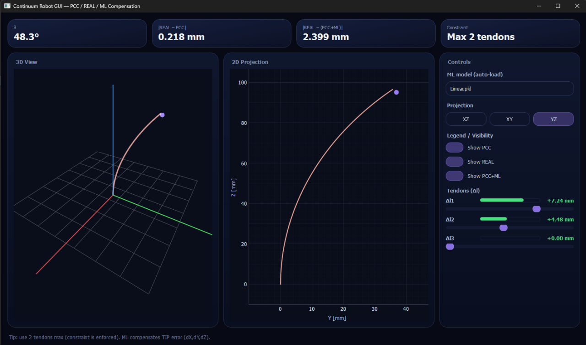
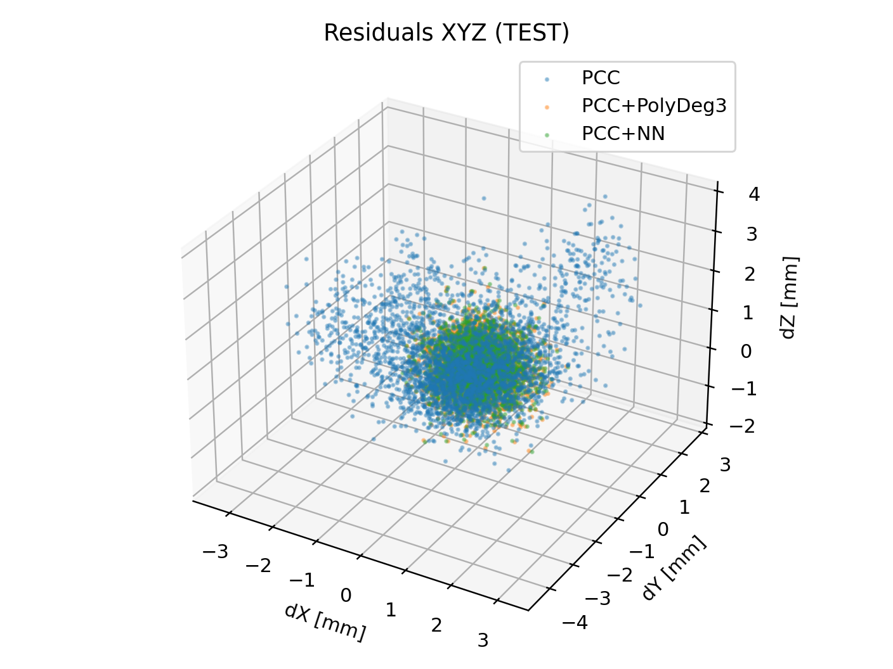
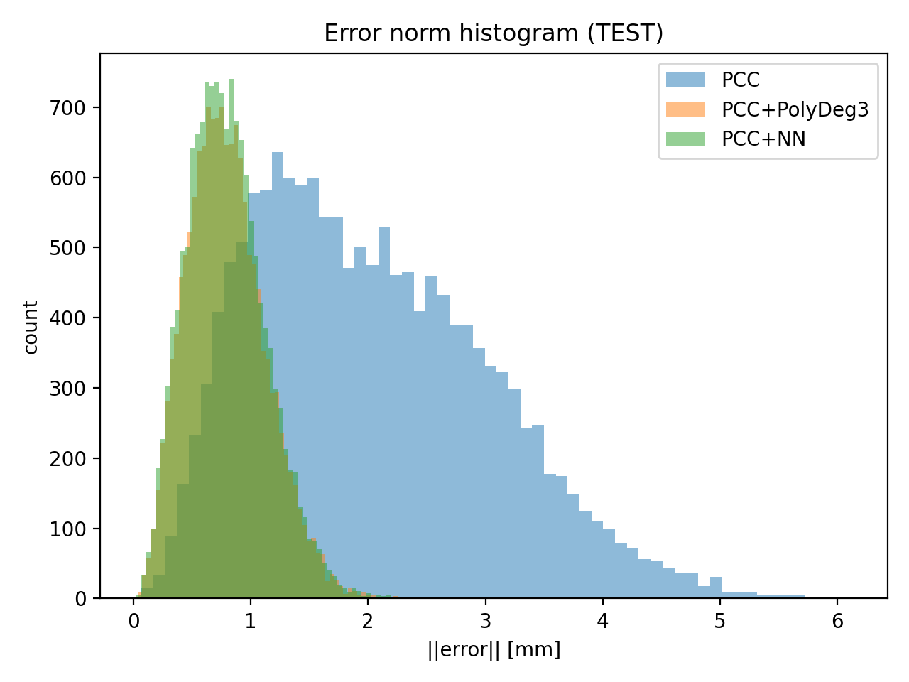
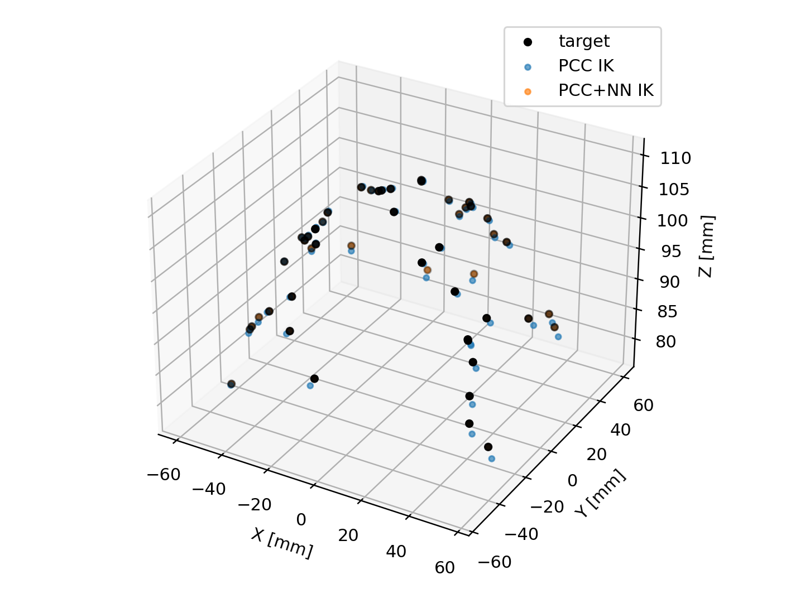
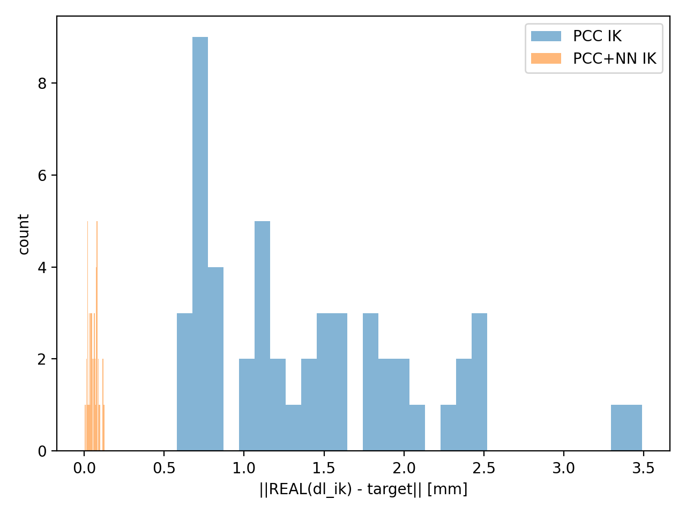
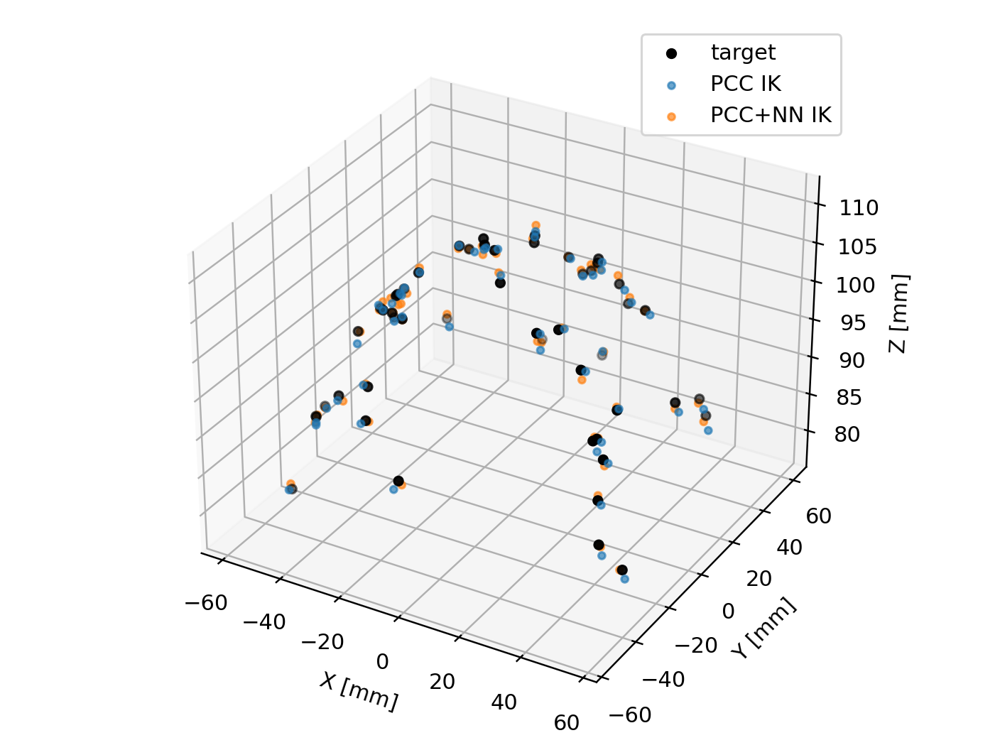
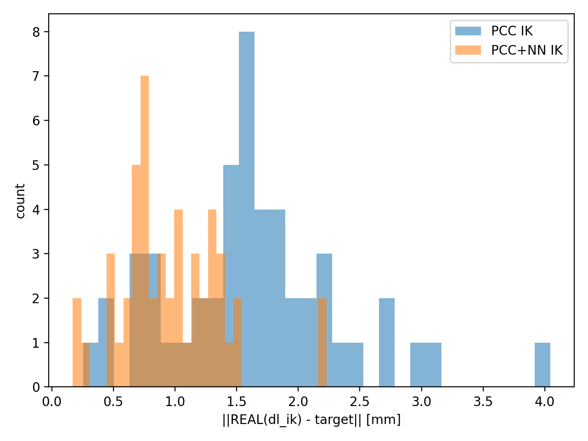

# continuum-robot-kinematics-error-compensation

Diploma project: **Machine Learning-Based Error Compensation for Continuum Robot Kinematics**.

The repository implements a four-phase workflow:

- Phase 1: analytical PCC forward kinematics.
- Phase 2: synthetic REAL model and dataset generation.
- Phase 3: residual neural-network error compensation.
- Phase 4: compensated inverse kinematics and benchmark comparison.

## Project Structure

```text
pcc_model.py                  Analytical PCC model.
real_model.py                 Synthetic REAL model used for data generation and evaluation.
generate_dataset.py           Phase 2 canonical synthetic dataset generation.
csv_to_nzp.py                 Converts canonical CSV dataset to NPZ.
train_nn_phase3.py            Phase 3 residual NN training.
eval_phase3_final.py          Phase 3 final evaluation.
phase4_inverse_kinematics.py  Phase 4 inverse kinematics benchmark.
pcc_gui.py                    GUI demo.
PROJECT_AUDIT_REPORT.md       Repository audit report, if present.

dataset_out/
  dataset_3.csv               Canonical Phase 2/3 CSV dataset.
  dataset_3.npz               Canonical Phase 2/3 NPZ dataset.

phase3_last_16_03_2026/       Canonical Phase 3 PyTorch NN artifacts.
phase3_final/                 Canonical Phase 3 final evaluation outputs.

phase4_results_noise0/        Main deterministic Phase 4 compensated-control benchmark.
phase4_results_noise05/       Phase 4 robustness check with Gaussian measurement noise.
phase4_results/               Legacy/default Phase 4 output folder from earlier runs.

models/                       Legacy sklearn models used by the GUI.
phase3_version_3/             Legacy NN artifact folder.
old/                          Older experiments and prototypes.
```

Legacy artifacts are intentionally kept for traceability. The GUI currently loads legacy sklearn models from `models/`. Phase 3 and Phase 4 use the PyTorch NN from `phase3_last_16_03_2026/`.

## Installation

```bash
python -m venv .venv
.venv\Scripts\activate
pip install -r requirements.txt
```

`PySide6` and `pyqtgraph` are needed only for `pcc_gui.py`. The command-line Phase 2-4 pipeline does not require the GUI to be launched.

## Canonical Phase 2/3 Workflow

```bash
python generate_dataset.py
python csv_to_nzp.py
python train_nn_phase3.py
python eval_phase3_final.py
```

Canonical paths:

```text
dataset_out/dataset_3.csv
dataset_out/dataset_3.npz
phase3_last_16_03_2026/
phase3_final/
```

## Phase 4 Workflow

Single-target smoke test:

```bash
python phase4_inverse_kinematics.py --target 0 0 110
```

Main deterministic compensated-control benchmark:

```bash
python phase4_inverse_kinematics.py --n-targets 50 --seed 42 --real-noise-sigma 0 --out-dir phase4_results_noise0
```

Noisy robustness benchmark:

```bash
python phase4_inverse_kinematics.py --n-targets 50 --seed 42 --real-noise-sigma 0.5 --out-dir phase4_results_noise05
```

Each Phase 4 benchmark folder contains:

- `phase4_results.csv`
- `comparison_metrics.csv`
- `summary.json`
- `error_hist.png`
- `target_vs_reached_3d.png`
- `error_vs_target_index.png`
- `error_vs_dl_norm.png`

## Methodological Notes

- In Phase 3, the NN predicts residual error `dX,dY,dZ = REAL - PCC`, not absolute XYZ.
- In Phase 4, the corrected forward model is `f_corr(dl) = f_PCC(dl) + f_NN(dl)`.
- `real_model.py` is not used inside the IK solver.
- `real_model.py` is used only for target generation and final evaluation.
- The deterministic Phase 4 benchmark evaluates systematic compensated-control accuracy.
- The noisy Phase 4 benchmark shows robustness under Gaussian measurement noise.

## Phase 4 Results

Deterministic benchmark, `phase4_results_noise0/comparison_metrics.csv`:

| Method | MAE_norm [mm] | RMSE_norm [mm] | MAX_norm [mm] |
|---|---:|---:|---:|
| PCC IK | 1.425770 | 1.591130 | 3.489732 |
| PCC+NN IK | 0.057609 | 0.065006 | 0.127452 |

Noisy robustness benchmark, `phase4_results_noise05/comparison_metrics.csv`:

| Method | MAE_norm [mm] | RMSE_norm [mm] | MAX_norm [mm] |
|---|---:|---:|---:|
| PCC IK | 1.633095 | 1.783236 | 4.044686 |
| PCC+NN IK | 0.965636 | 1.052073 | 2.228440 |

## Figures





## Phase 4 Figures

### Deterministic benchmark (`phase4_results_noise0/`)

Target vs reached positions in 3D:



Error norm histogram:



### Noisy robustness benchmark (`phase4_results_noise05/`)

Target vs reached positions in 3D:



Error norm histogram:

