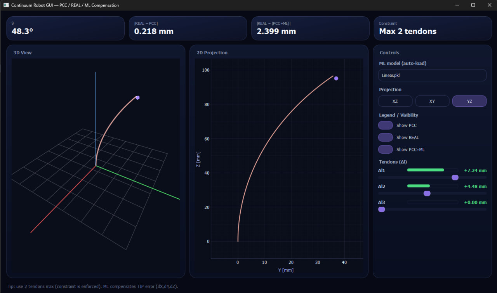
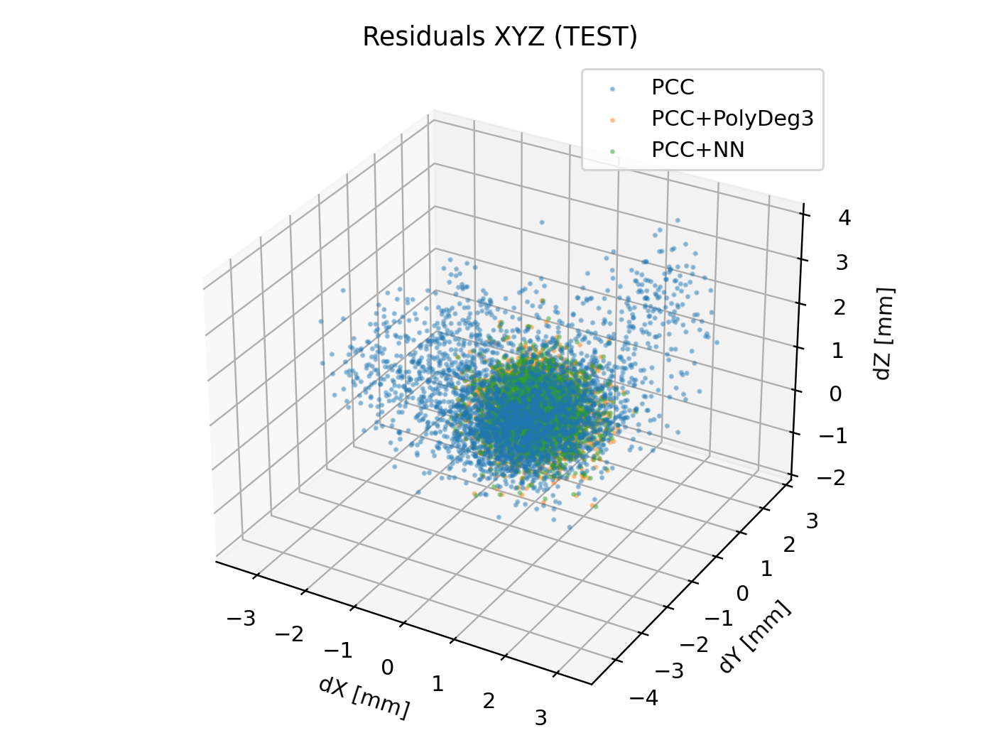
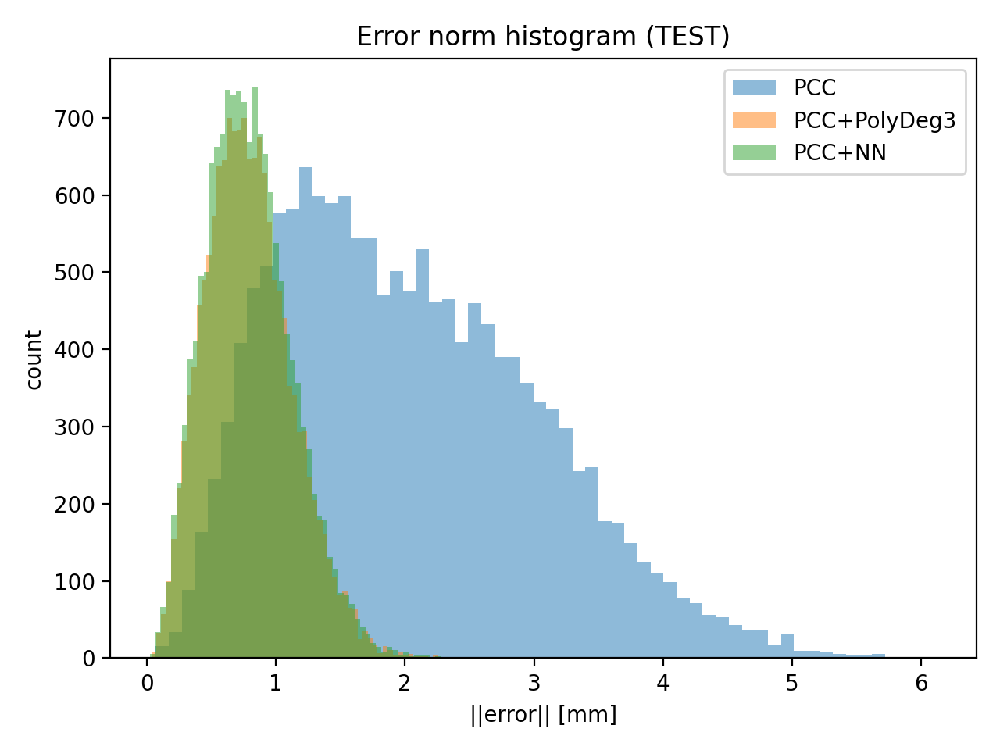
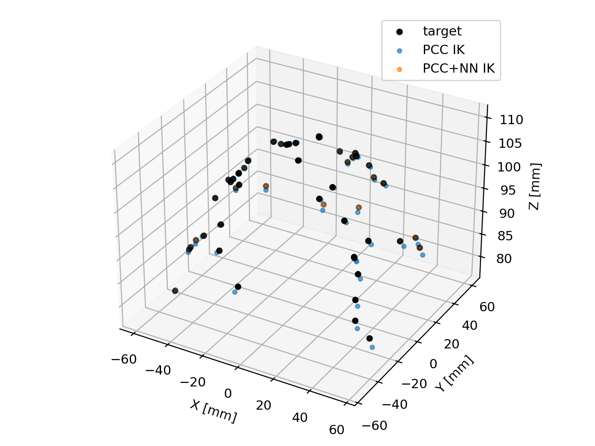
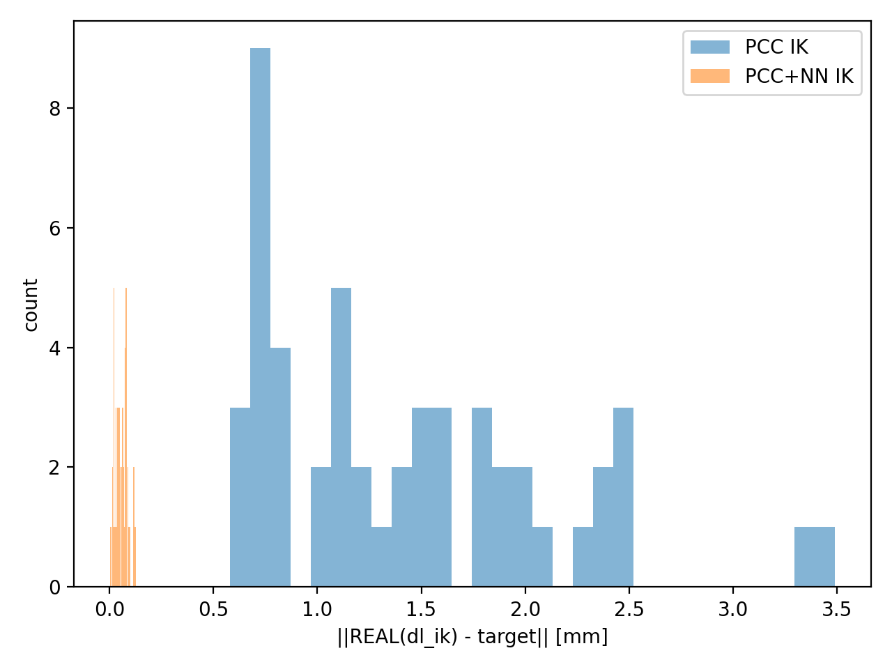
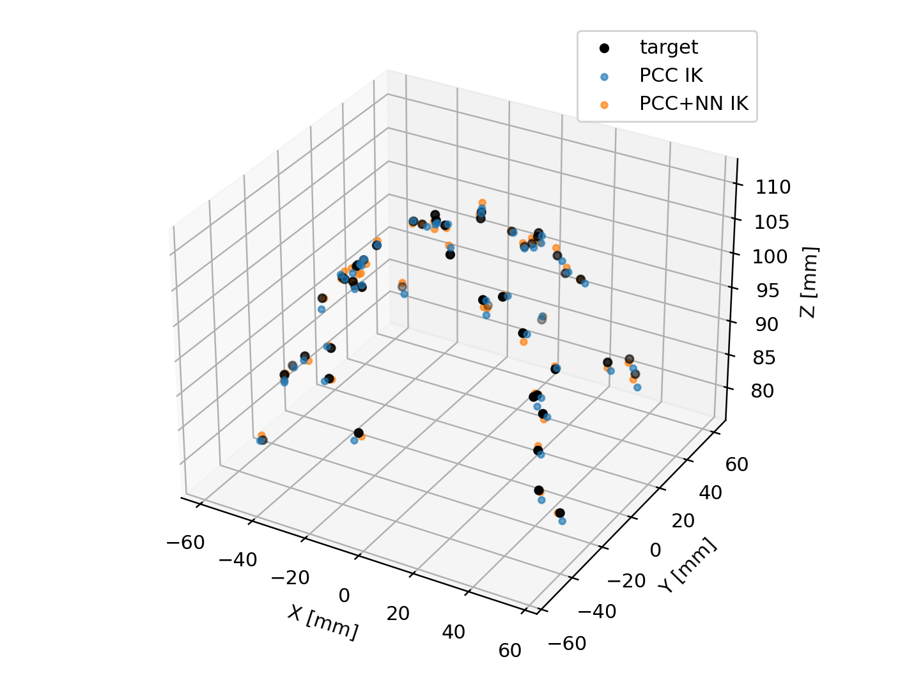
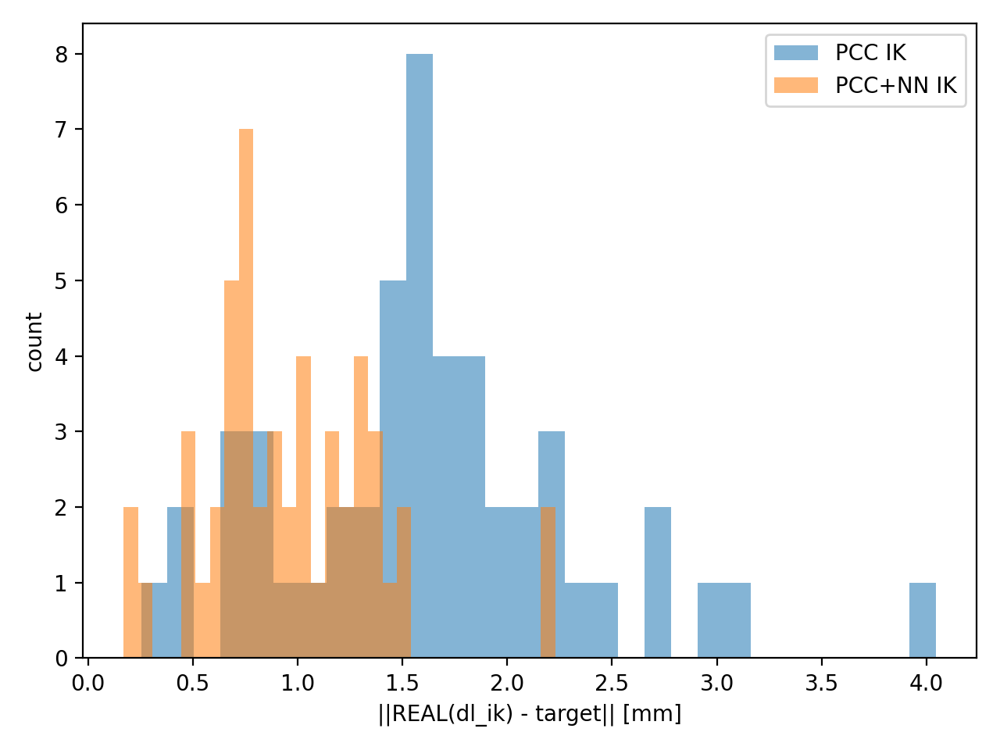

# Continuum robot kinematics error compensation

Diploma thesis: **Machine Learning-Based Error Compensation for Continuum Robot Kinematics** / **Kompenzácia chýb kinematiky kontinuum robota pomocou strojového učenia**.

This repository studies a one-segment, three-tendon continuum robot in simulation. The nominal backbone length is 110 mm, the PCC tendon-routing parameter is 5 mm, and tendon shortening is limited to 0-10 mm with at most two active tendons. Positions and errors are reported in millimetres.

## PCC model (Phase 1)

`pcc_model.py` implements the ideal piecewise constant-curvature (PCC) forward model. Tendon shortenings are actuator coordinates; bending-plane angle `phi`, curvature `kappa`, and bend angle `theta` are configuration coordinates; the end-effector position `(X,Y,Z)` is the task coordinate. `pcc_shape` returns the centreline for workspace/shape visualization, and `pcc_forward` returns its tip. The existing equations and coordinate assumptions are preserved.

## Synthetic reference model (Phase 2)

`real_model.py` is a **synthetic reference model**, also called a perturbed PCC model. Despite its historical filename, it is **not a model identified from a physical robot**. It adds controlled curvature nonlinearity, bending-plane asymmetry, bend saturation, a systematic position offset, and Gaussian measurement noise to create a reproducible simulation testbed while physical robot measurements are unavailable. Results in this repository establish synthetic feasibility; they do not demonstrate physical-robot accuracy.

### Dataset generation

`generate_dataset.py` uses seed 42 to sample 20,000 valid tendon commands (at most two active), evaluates both forward models, and writes `dl1,dl2,dl3`, PCC XYZ, synthetic-reference XYZ, and `dX,dY,dZ = p_syn - p_PCC` to `dataset_out/dataset_3.csv`. `csv_to_nzp.py` converts the command/residual pairs to `dataset_out/dataset_3.npz` (`X` and `Y`). The CSV retains the full position columns.

## Phase 3 residual compensation and final evaluation

The PyTorch feedforward NN represents the **Cartesian residual**, not absolute XYZ: `f_NN(dl) ≈ p_syn(dl) - f_PCC(dl)`. The corrected forward position is `f_PCC(dl) + f_NN(dl)`. `train_nn_phase3.py` uses a seeded train/validation/test split (70/15/15) and fits input/output scalers on the training split only. Its model, scalers, training metrics, and loss curve are in `phase3_last_16_03_2026/`.

`eval_phase3_final.py` reproduces the historical Phase 3 comparison. `evaluate_phase3_final_extended.py` adds Linear Regression, degree-3 Polynomial Ridge, KNN, and the **pretrained** canonical NN to a common held-out test comparison. Regressors and their scalers fit only on training rows; the NN is loaded without retraining. Errors compare PCC plus predicted residual with the synthetic-reference position. It also reports a large-bend test subset (`max(dl) >= 9 mm`, two active tendons).

## Phase 4 IK validation

`phase4_inverse_kinematics.py` numerically solves tendon commands with either PCC or the corrected forward model under 0-10 mm and at most two active tendons. The synthetic reference model is used **only to generate targets and evaluate reached positions**, never inside the IK solver. IK error is `e_IK = f_syn(dl_IK) - p_target`, not the Phase 3 forward-model error at the original source command.

`evaluate_phase4_ik_extended.py` compares PCC IK and PCC+NN IK on at least 50 reachable targets. It includes random points and a deliberate large-bend subset with two active tendons, one shortened by 9-10 mm and the other by 7-10 mm. The deterministic run (`sigma=0`) measures systematic compensated-control accuracy. The optional noisy run (`sigma=0.5 mm`) tests robustness to Gaussian measurement noise; it uses separate noise draws for targets and final reached positions and pairs the same final noise draw across methods for each target.

## Project files

| Path | Role |
|---|---|
| `pcc_model.py`, `real_model.py` | Ideal PCC and synthetic reference forward models |
| `generate_dataset.py`, `csv_to_nzp.py` | Canonical Phase 2 dataset pipeline |
| `dataset_out/dataset_3.csv`, `dataset_out/dataset_3.npz` | Final synthetic dataset lineage |
| `train_nn_phase3.py`, `phase3_last_16_03_2026/` | Canonical Phase 3 training script and PyTorch NN/scalers |
| `eval_phase3_final.py`, `phase3_final/` | Existing Phase 3 evaluation and results |
| `phase4_inverse_kinematics.py` | Existing Phase 4 solver and benchmark |
| `phase4_results_noise0/`, `phase4_results_noise05/` | Existing deterministic and noisy Phase 4 benchmarks |
| `generate_pipeline_figure.py` | Methodological figure generator |
| `evaluate_phase3_final_extended.py` | Five-method Phase 3 final tables/figures |
| `evaluate_phase4_ik_extended.py` | Phase 4 final IK tables/figures |
| `run_summer_synthetic_experiments.py` | Four additional synthetic studies |
| `pcc_gui.py` | GUI demonstration using legacy sklearn models |

`PROJECT_AUDIT_REPORT.md` may be present in earlier workspaces; it is not required to run this checkout. Legacy/reference items such as `models/`, older datasets in `dataset_out/`, `phase3_version_3/`, `phase4_results/`, `old/`, `ml_models.py`, and `train_nn_optuna.py` are kept for traceability. The GUI currently uses legacy sklearn artifacts in `models/`; Phase 3/4 validation uses the canonical PyTorch NN in `phase3_last_16_03_2026/`.

## Installation

```bash
python -m venv .venv
.venv\Scripts\activate
pip install -r requirements.txt
```

`PySide6` and `pyqtgraph` are needed only for `pcc_gui.py`. `Jinja2` supports the generated LaTeX tables. Run commands below from the repository root.

## Reproducibility commands

The existing canonical Phase 2/3 workflow is:

```bash
python generate_dataset.py
python csv_to_nzp.py
python train_nn_phase3.py
python eval_phase3_final.py
```

The first three commands regenerate data or retrain the canonical model and can take time; they are **not needed** to use the existing artifacts for final validation. Run them only when intentionally rebuilding the lineage.

To create the thesis methodology figure and extended final reports:

```bash
python generate_pipeline_figure.py
python evaluate_phase3_final_extended.py
python evaluate_phase4_ik_extended.py --real-noise-sigma 0 --out-dir outputs/phase4_ik_validation
python evaluate_phase4_ik_extended.py --real-noise-sigma 0.5 --out-dir outputs/phase4_ik_validation_noise05
python run_summer_synthetic_experiments.py --quick
python run_summer_synthetic_experiments.py --full
```

`--quick` is a short pilot with fitting-pool sizes 500, 1000, 2000 and all three architectures. `--full` covers all six requested sizes through 20,000 and trains longer. The results below are from a completed **full** run. These commands run experiments and write outputs; none runs automatically. The summer noise study only **evaluates** the canonical model at five noise levels; dataset-size, range, and architecture studies train separate experimental NNs and do not overwrite the canonical model.

## Additional synthetic experiments

`run_summer_synthetic_experiments.py` produces four studies: (A) fitting-pool size, using an independent fixed test set; (B) Gaussian noise sigma 0, 0.2, 0.5, 0.8, and 1.0 mm, evaluating the unchanged canonical NN; (C) interpolation with training commands in 0-8 mm versus extrapolation to active tendon shortenings in (8,10] mm; and (D) 32-32, 128-64, and 256-128-64 hidden-layer architectures on the same split. Experimental NN inputs are the three shortenings plus activity indicators, and outputs are Cartesian residuals. Test sets are independent of training/validation sets; normalization is fit only on training data. The full run is intended for final thesis tables, while quick mode is a pilot. The script records the training or evaluation-only mode in `summary.json`.

Run the GUI with `python pcc_gui.py` after installing optional GUI dependencies.

## Existing Phase 4 workflow

Single-target smoke test:

```bash
python phase4_inverse_kinematics.py --target 0 0 110
```

Main deterministic compensated-control benchmark:

```bash
python phase4_inverse_kinematics.py --n-targets 50 --seed 42 --real-noise-sigma 0 --out-dir phase4_results_noise0
```

Noisy robustness benchmark:

```bash
python phase4_inverse_kinematics.py --n-targets 50 --seed 42 --real-noise-sigma 0.5 --out-dir phase4_results_noise05
```

Each Phase 4 benchmark folder contains:

- `phase4_results.csv`
- `comparison_metrics.csv`
- `summary.json`
- `error_hist.png`
- `target_vs_reached_3d.png`
- `error_vs_target_index.png`
- `error_vs_dl_norm.png`

## Final synthetic validation outputs

The final generated reports are:

| Output | Contents |
|---|---|
| `figures/pipeline_synthetic_compensation.png` | Synthetic compensation methodology scheme |
| `outputs/phase3_forward_compensation/` | `phase3_metrics.csv/.tex`, boundary table, copied `loss_curve.png`, histogram, five-model boxplot, 3D position plot, per-axis plot, `summary.json` |
| `outputs/phase4_ik_validation/` | `phase4_ik_metrics.csv/.tex`, per-target results, PCC and PCC+NN 3D plots, histogram, boxplot, ordered target/reached axis plot, configuration plot, `summary.json` |
| `outputs/phase4_ik_validation_noise05/` | Optional robustness report with the same Phase 4 files |
| `outputs/summer_experiments/` | CSV/LaTeX tables and figures for dataset size, noise, range generalization, architecture, plus `summary.json` |

All tables below report Euclidean-norm errors in mm, displayed to six decimal places from the linked generated CSV files. The CSV files retain full precision and include per-axis metrics; `summary.json` files provide seeds, split or target counts, and method provenance.

### Phase 3 forward compensation

Held-out test set (`N=3000`): [full metrics CSV](outputs/phase3_forward_compensation/phase3_metrics.csv), [LaTeX table](outputs/phase3_forward_compensation/phase3_metrics.tex), [boundary metrics](outputs/phase3_forward_compensation/phase3_boundary_metrics.csv), [provenance](outputs/phase3_forward_compensation/summary.json).

| Method | MAE | RMSE | Median | P95 | Max |
|---|---:|---:|---:|---:|---:|
| PCC | 1.991968 | 2.226582 | 1.834655 | 3.810949 | 5.642002 |
| PCC + Linear Regression | 1.168793 | 1.284540 | 1.099738 | 2.152395 | 3.020670 |
| PCC + Polynomial Ridge | 0.799012 | 0.868309 | 0.770045 | 1.406348 | 2.196424 |
| PCC + KNN | 0.881152 | 0.954825 | 0.852146 | 1.533199 | 2.619147 |
| PCC + NN | 0.799555 | 0.868962 | 0.768868 | 1.416337 | 2.199613 |

Polynomial Ridge has a slightly lower RMSE than the NN on this noisy held-out set; the NN is not claimed as the best Phase 3 method by every metric. The Phase 4 comparison nevertheless uses the canonical pretrained NN as specified.

### Phase 4 inverse kinematics

Deterministic synthetic-reference benchmark (`sigma=0`, `N=50`): [full metrics CSV](outputs/phase4_ik_validation/phase4_ik_metrics.csv), [LaTeX table](outputs/phase4_ik_validation/phase4_ik_metrics.tex), [per-target results](outputs/phase4_ik_validation/phase4_ik_results.csv), [provenance](outputs/phase4_ik_validation/summary.json).

| Method | MAE | RMSE | Median | P95 | Max |
|---|---:|---:|---:|---:|---:|
| PCC IK | 1.821636 | 2.107236 | 1.588586 | 3.913806 | 4.332032 |
| PCC+NN IK | 0.049033 | 0.056883 | 0.044249 | 0.092010 | 0.127452 |

Noisy robustness benchmark (`sigma=0.5 mm`, `N=50`): [full metrics CSV](outputs/phase4_ik_validation_noise05/phase4_ik_metrics.csv), [LaTeX table](outputs/phase4_ik_validation_noise05/phase4_ik_metrics.tex), [per-target results](outputs/phase4_ik_validation_noise05/phase4_ik_results.csv), [provenance](outputs/phase4_ik_validation_noise05/summary.json).

| Method | MAE | RMSE | Median | P95 | Max |
|---|---:|---:|---:|---:|---:|
| PCC IK | 2.027120 | 2.297321 | 1.742344 | 4.031159 | 4.820420 |
| PCC+NN IK | 0.855486 | 0.961908 | 0.810726 | 1.679299 | 2.245389 |

These are reached-position errors after applying each IK solution to the synthetic reference model. They are not forward-model residuals at the original target-generating tendon command.

### Summer synthetic experiments

Dataset-size influence, full run (independent test set `N=2000`): [full metrics CSV](outputs/summer_experiments/dataset_size_metrics.csv), [LaTeX table](outputs/summer_experiments/dataset_size_metrics.tex).

| Training size | MAE | RMSE | Median | P95 | Max |
|---:|---:|---:|---:|---:|---:|
| 500 | 0.824620 | 0.892173 | 0.793764 | 1.441971 | 2.354731 |
| 1000 | 0.811606 | 0.878300 | 0.783915 | 1.432728 | 2.388352 |
| 2000 | 0.805804 | 0.872175 | 0.780262 | 1.411289 | 2.323646 |
| 5000 | 0.802938 | 0.869335 | 0.772476 | 1.406135 | 2.280766 |
| 10000 | 0.802264 | 0.868225 | 0.771130 | 1.398871 | 2.308417 |
| 20000 | 0.802398 | 0.868554 | 0.771046 | 1.398696 | 2.295354 |

Noise influence, canonical NN **evaluated only**, without retraining (`N=2000` at each sigma): [full metrics CSV](outputs/summer_experiments/noise_metrics.csv), [LaTeX table](outputs/summer_experiments/noise_metrics.tex).

| Noise sigma [mm] | MAE | RMSE | Median | P95 | Max |
|---:|---:|---:|---:|---:|---:|
| 0.0 | 0.062491 | 0.069372 | 0.056445 | 0.120454 | 0.245513 |
| 0.2 | 0.318873 | 0.346629 | 0.308127 | 0.567772 | 0.846630 |
| 0.5 | 0.784329 | 0.852337 | 0.755865 | 1.385394 | 2.180351 |
| 0.8 | 1.252718 | 1.361170 | 1.208753 | 2.212652 | 3.514583 |
| 1.0 | 1.565294 | 1.700745 | 1.509295 | 2.762952 | 4.404127 |

Range generalization, separately trained experimental NN (`N=1000` per range and method): [full metrics CSV](outputs/summer_experiments/generalization_metrics.csv), [LaTeX table](outputs/summer_experiments/generalization_metrics.tex).

| Test range [mm] | Method | MAE | RMSE | Median | P95 | Max |
|---|---|---:|---:|---:|---:|---:|
| Inside [0,8] | PCC | 1.348383 | 1.479953 | 1.251646 | 2.468678 | 3.242957 |
| Inside [0,8] | PCC+NN | 0.006520 | 0.007994 | 0.005408 | 0.014326 | 0.056474 |
| Outside (8,10] | PCC | 2.963311 | 3.034945 | 2.873074 | 4.318111 | 4.596224 |
| Outside (8,10] | PCC+NN | 0.221034 | 0.259360 | 0.206914 | 0.460891 | 0.577039 |

The experimental NN's error rises outside its 0-8 mm training range, although it remains below PCC error in this synthetic test. This does not establish extrapolation performance on a physical robot.

Architecture comparison, separately trained experimental NNs on the same test set (`N=2000`): [full metrics CSV](outputs/summer_experiments/architecture_metrics.csv), [LaTeX table](outputs/summer_experiments/architecture_metrics.tex), [provenance for all summer studies](outputs/summer_experiments/summary.json).

| Architecture | Hidden layers | MAE | RMSE | Median | P95 | Max |
|---|---|---:|---:|---:|---:|---:|
| Small | 32, 32 | 0.804880 | 0.871252 | 0.778165 | 1.399680 | 2.327911 |
| Medium | 128, 64 | 0.802938 | 0.869335 | 0.772476 | 1.406135 | 2.280766 |
| Large | 256, 128, 64 | 0.803858 | 0.870734 | 0.778169 | 1.397376 | 2.360755 |

### Final figures

- Methodology: [synthetic compensation pipeline](figures/pipeline_synthetic_compensation.png).
- Phase 3: [NN loss curve](outputs/phase3_forward_compensation/loss_curve.png), [PCC vs NN error histogram](outputs/phase3_forward_compensation/error_hist_pcc_vs_nn.png), [five-model error boxplot](outputs/phase3_forward_compensation/model_error_boxplot.png), [reference/PCC/NN 3D positions](outputs/phase3_forward_compensation/reference_pcc_nn_3d.png), [per-axis errors](outputs/phase3_forward_compensation/axis_errors.png).
- Phase 4 deterministic: [PCC IK target vs reached 3D](outputs/phase4_ik_validation/pcc_ik_target_vs_reached_3d.png), [PCC+NN IK target vs reached 3D](outputs/phase4_ik_validation/pcc_nn_ik_target_vs_reached_3d.png), [error histogram](outputs/phase4_ik_validation/ik_error_histogram.png), [error boxplot](outputs/phase4_ik_validation/ik_error_boxplot.png), [target vs reached trajectory](outputs/phase4_ik_validation/target_vs_reached_trajectory.png), [error vs configuration](outputs/phase4_ik_validation/error_vs_configuration.png).
- Phase 4 noisy: [PCC IK target vs reached 3D](outputs/phase4_ik_validation_noise05/pcc_ik_target_vs_reached_3d.png), [PCC+NN IK target vs reached 3D](outputs/phase4_ik_validation_noise05/pcc_nn_ik_target_vs_reached_3d.png), [error histogram](outputs/phase4_ik_validation_noise05/ik_error_histogram.png), [error boxplot](outputs/phase4_ik_validation_noise05/ik_error_boxplot.png), [target vs reached trajectory](outputs/phase4_ik_validation_noise05/target_vs_reached_trajectory.png), [error vs configuration](outputs/phase4_ik_validation_noise05/error_vs_configuration.png).
- Summer studies: [dataset-size RMSE](outputs/summer_experiments/dataset_size_rmse.png), [noise RMSE](outputs/summer_experiments/noise_rmse.png), [range-generalization boxplot](outputs/summer_experiments/generalization_boxplot.png), [architecture boxplot](outputs/summer_experiments/architecture_boxplot.png).

## Methodological notes

- In Phase 3, the NN predicts residual error `dX,dY,dZ = synthetic reference - PCC`, not absolute XYZ.
- In Phase 4, the corrected forward model is `f_corr(dl) = f_PCC(dl) + f_NN(dl)`.
- `real_model.py` is not used inside the IK solver.
- `real_model.py` is used only for target generation and final evaluation.
- The deterministic Phase 4 benchmark evaluates systematic compensated-control accuracy.
- The noisy Phase 4 benchmark checks robustness under Gaussian measurement noise.

## Legacy / previous benchmark outputs

These legacy figures are kept only for traceability and are not the main final thesis outputs.

### Existing Phase 4 results

The values below come from the earlier 50-target benchmark folders. The final extended IK validation above deliberately adds boundary-heavy targets and uses a paired noise protocol; the two benchmark generations are not directly comparable.

Deterministic benchmark, `phase4_results_noise0/comparison_metrics.csv`:

| Method | MAE_norm [mm] | RMSE_norm [mm] | MAX_norm [mm] |
|---|---:|---:|---:|
| PCC IK | 1.425770 | 1.591130 | 3.489732 |
| PCC+NN IK | 0.057609 | 0.065006 | 0.127452 |

Noisy robustness benchmark, `phase4_results_noise05/comparison_metrics.csv`:

| Method | MAE_norm [mm] | RMSE_norm [mm] | MAX_norm [mm] |
|---|---:|---:|---:|
| PCC IK | 1.633095 | 1.783236 | 4.044686 |
| PCC+NN IK | 0.965636 | 1.052073 | 2.228440 |

### Figures





### Phase 4 Figures

#### Deterministic benchmark (`phase4_results_noise0/`)

Target vs reached positions in 3D:



Error norm histogram:



#### Noisy robustness benchmark (`phase4_results_noise05/`)

Target vs reached positions in 3D:



Error norm histogram:


